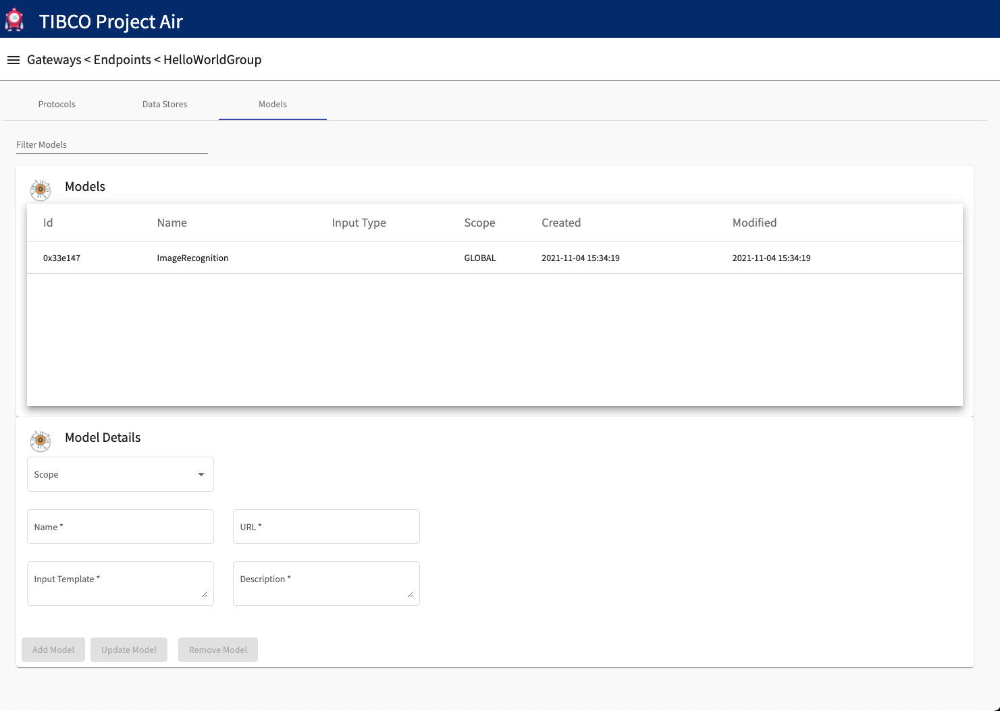

## Introduction
THIS IS A TEST Once a Device Grouping has been discovered by project AIR, a connection has been established with edge devices.
In this section we show how to configure Messaging Protocos, Data Stores and ML Model connections which can be used in Data Pipelines to receive, process data from devices, and publish device data to other edge or cloud applications.
The following steps will guide you through the configuration of messaging protocols, data stores and ML models connections.

## Prerequisites

#### Prerequisite 1: Edgex

Edgex is a vendor neutral open source platform at the edge of the network that interacts with physical devices, sensors, actuators and other IoT objects. It enables the interoperability between devices and applications at the edge and at the cloud.
Edgex will be installed as part of the AIR installation.

* [Edgex](edgexfoundry.org)

Every running Edgex platform uses an internal messaging bus to move data through the different layers at the edge. From a running instance of Edgex, gather the following information:

 * Transport used: MQTT, ZeroMQ or Redis
 * Connection URL
 * Connection credentials

 #### Prerequisite 2: AIR

Project AIR installation provides a messaging broker for sending data from edge devices to wherever the AIR infrastructure is running (in premise, cloud).  The messaging infrastructure is used by AIR core components and also can be used by any application requiring to receive data from edge devices and data flows.

From a running AIR installation, gather the following information:

 * Transport used: MQTT, Kafka or TCM
 * Connection URL
 * Connection credentials

 The following tables provide default connection details for the basic demo example.

#### Edgex MQTT
| Property      | Value |
| ----------- | ----------- |
| Hostname      | edgex-mqtt-broker |
| Port   | 1883 |
| Topic   | edgexevents |
| Username   |  |
| Password   |  |

#### AIR MQTT
| Property      | Value |
| ----------- | ----------- |
| Hostname      | mosquitto |
| Port   | 31883 |
| Topic   | EdgexGatewayData |
| Username   | mqtt_admin |
| Password   | mqtt_admin |

#### AIR Notifications MQTT
| Property      | Value |
| ----------- | ----------- |
| Hostname      | mosquitto |
| Port   | 31883 |
| Topic   | EdgexGatewayNotification |
| Username   | mqtt_admin |
| Password   | mqtt_admin |

#### Prerequisite 3: Data Store Information

Device data can be stored in one or several data stores depending on the use case requirements. Gather the following information for each data store:

* Connection URL
* Connection Credentials

#### Prerequisite 3: Data Store Table Setup

For each required data store, the user needs to configure the data store and create tables to store the data. 
Project AIR provides scripts with SQL commands to create the required artifacts. 

Following is an example sql script to create the artifact for a Postgres Database.
[Postgres SQL script](./setup.sql)

 ## Accessing Endpoints Configuration

#### Step 1: From the Gateways page, select the Device Group you want to configure.

#### Step 2: Click the Endpoints Configuration Icon.

#### Step 3: The Endpoint configuration page should be displayed.

## Adding Messaging Protocols

#### Step 1: Select the desired protocol from the pulldown menu under the Protocol Details panel

#### Step 2: Enter required information for the selected protocol

#### Step 2: Click the Add Protocol button. The new protocol configuration should be shown in the Inbound Protocols panel

## Adding Data Stores

#### Step 1: Click the Data Stores tab

#### Step 2: Select the desired data store from the pulldown menu under the DataStore Details panel

#### Step 3: Enter required information for the selected data store

#### Step 4: Click the Add Data Store button. The new data store configuration should be shown in the Data Stores panel

Note that before using the data store in a pipeline, the AIR required tables need to be setup.  Project AIR provides scripts for the creation of the required tables for all the different data stores.  See pre-requisites section for details.

## Adding ML Model Connections

#### Step 1: Click the Models tab

#### Step 2: Enter the model information under the Model Details panel

Scope: select either GLOBAL or GATEWAY:
 * GLOBAL means the connection will be available and visible to all the pipeline configuration across
 * GATEWAY means the connection will be visible only to the pipelines in the current gateway.

Name: is the name of the model connection

URL: is the address of the model's REST interface.

Input Template: allow users to provide a json schema definition of the input the model is expecting.  Project air provides template keys that allow device data to be mapped to the required fields in the model.

Description: allow users to provide a description of what the model does.  This information will be available to users when configuring pipelines.

#### Step 3: Enter required information for the model connection

#### Step 4: Click the Add Model button. The new model connection configuration should be shown in the Models panel

