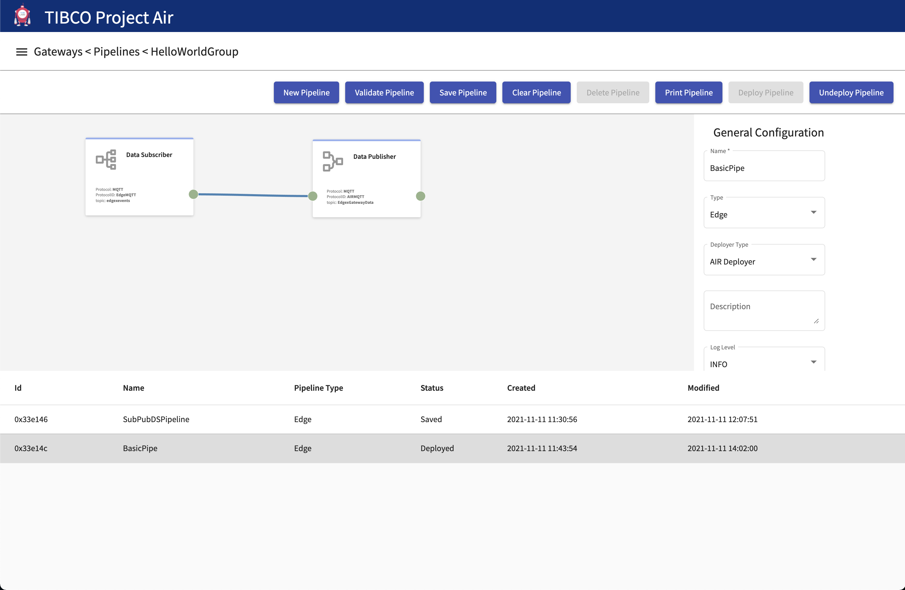
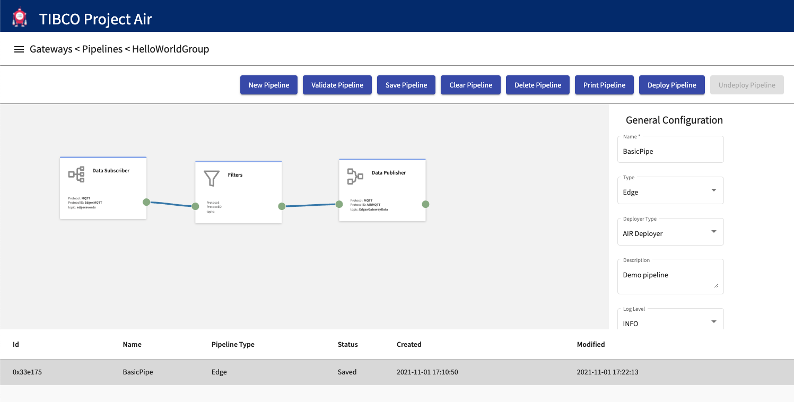

## Introduction
TIBCO Project AIR enables users to configure flows/business logic with data from edge devices.
Users can configure a Data Pipeline (Data Flow) to sequence, filter, stream data and specify a data store based on your business logic.
A typical pipeline configuration consists of activities that define the messaging protocol to receive data, define operations on the data (filtering, streaming, inferencing, rules) and the data stores.
This section will guide you through all the steps required to  create data pipelines.

## Architecture Overview


Every AIR deployment consist of edge components (devices, edge framework), as well as components that can be colocated at the edge, on premise, or on a private or public clooud.
Devices interact with whole AIR infrastructure through Edgex adapters providing the device's required communication protocol and data standard.  Data traverse through the Edgex layers using an internal Edgex messaging protocol (i.e. MQTT).  Data is standardized and converted into a common schema which can then be used by any application at the Edgex Service Layer (.ie. AIR Pipelines).
AIR Pipelines can be configured from the provided UI which can be running locally or remotely. Pipelines are configured to recieve/subscribe standardized data from devices using the provided Edgex internal messaging protocol, filter, stream, infer, apply rules to the data and then publish the data to other applications.
Data can be published to AIR applications or other pipelines running at the edge or at the cloud.  Applications can use the messaging protocol (i.e. MQTT) provided by AIR infrastructure.
Once the pipelines are configured, pipelines are converted into Flogo Applications, compiled to the desired platform, conteinerized and then deployed.


## Prerequisites

#### Prerequisite 1: Device Groups Configuration

Before you begin, make sure the messaging protocols, data stores and models configuration for device groups have been configured. See [here](../../tutorials).
See Configuring Device Groups.


## Adding Data Pipelines

#### Step 1: Open Pipeline Editor
From the Gateways page, select the Device Group you want to configure and click Pipeline Editor Icon.


#### Step 2: The Pipelines Editor page should be displayed.


#### Step 3: Subscribe to device events
On the editor canvas, right click and select the Data Subscriber activity.

Most data pipelines start subscribing to events coming from devices. The Data Subscriber activity allows users to select the source of the device data.


#### Step 4: Configure Data Subscriber
On the activity configuration panel, select and review the messaging protocol

All the messaging protocols that have previously been configured in the Device Groups Configuration will be available for selection.  Select the source for device events.


#### Step 5: Filter device data (Optional)
Select the devices to filter by selecting the Filter Activity.

Data can be filtered from going through the pipeline. Right click on the editor canvas and select Filters.


#### Step 6: Configure filter activity

On the activity configuration panel, select device and resource (sensors) data to be filtered. Only the sensor data/resources non-selected in the list will be propagated through the pipeline. Connect activities by selecting the connection ports.


#### Step 7: Publish device data
On the editor canvas, right click and select the Data Publisher activity.

Device data can be published to any messaging protocol that has been previously configured in the Device Groups connection pages.


#### Step 8: Configure Data Publisher
On the activity configuration panel, select and review the messaging protocol

All the messaging protocols that have previously been configured in the Device Groups Configuration will be available for selection.  Select the destination for device events.


#### Step 9: Name and Save Data Pipeline.

After entering pipeline name, deployment target and deployer type, save the pipeline configuration.  The configuration can then be deployed to a Kubernetes cluster either local or on the cloud.


## Deploying Data Pipelines

Once data pipelines have been configured, they can be deployed dynamically to Kubernetes cluster running locally or on the cloud.

#### Step 1: Select the desired pipeline from the Pipelines table and then click  Deploy Pipeline


#### Step 2: The pipeline is deployed and should show the Status as Ready/Deployed


## Verifying Data Pipelines Deployment

After a pipeline is deployed from the UI, a Docker container is started in the deployment target machine.
There are several ways to verify the container is up and running. In this section we will use Docker Desktop to verify and inspect the deployed contianer.

#### Step 1: Note Id of deployed Pipeline

After the pipeline is deployed, a new entry will be shown in the pipelines table.  Note the id of the pipeline as that will be used to identify the running container.



#### Step 2: Open Docker Dashboard

Open Docker Dashboard UI and select the Containers/Apps tab. A list of all running containers is shown.


#### Step 3: Inspect Container

From the list of containers, select and open the container matching the Id noted in Step1.


#### Step 4: Viewing Container Logs

After container is selected, select the LOGS tab to view the container logs.


#### Step 5: Viewing Container Stats

From selected container panel, select the STATS tab to review container's cpu usage, memory usage, etc.


## Updeploying Data Pipelines
If data from a device is not longer required or if needs to be modified, you can undeploy the pipeline.  Undeploying will remove the engine processing the data from the Kubernetes cluster.

#### Step 1: Select the desired pipeline from the Pipelines table and then click Undeploy Pipeline


#### Step 2: The pipeline is undeployed and should show the Status as Undeployed/Saved


## Deleting Data Pipelines
If data pipelines are not longer required, you can delete the pipeline. Notice that deployed pipelines can't be deleted.  They need to be undeployed first.

#### Step 1: Select the desired pipeline from the Pipelines table and then click  Delete Pipeline



#### Step 2: The pipeline is deleted and should not appear in the Pipelines table.

## Subscribing to data published by Pipelines
Data published by AIR pipelines is available to other pipelines or to any external application that has access to the AIR messaging infrastructure (i.e. MQTT).
Applications with permissions to connect to the messaging infrastructure can subscribe to the published data.
The following section provides the topic and schema of the data users need to use to receive data from AIR pipelines.


#### Topic: EdgexGatewayData

#### Message Schema:

```JSON
{
    "type": "object",
    "title": "MQTTSubscriber",
    "properties": {
        "topic": {
            "type": "string",
            "required": false
        },
        "retained": {
            "type": "boolean",
            "required": false
        },
        "qos": {
            "type": "integer",
            "required": false
        },
        "body": {
            "$schema": "http://json-schema.org/draft-04/schema#",
            "type": "object",
            "properties": {
                "id": {
                    "type": "string"
                },
                "device": {
                    "type": "string"
                },
                "origin": {
                    "type": "number"
                },
                "gateway": {
                    "type": "string"
                },
                "readings": {
                    "type": "array",
                    "items": {
                        "type": "object",
                        "properties": {
                            "id": {
                                "type": "string"
                            },
                            "origin": {
                                "type": "number"
                            },
                            "device": {
                                "type": "string"
                            },
                            "name": {
                                "type": "string"
                            },
                            "value": {
                                "type": "string"
                            }
                        }
                    }
                }
            }
        }
    }
}
```


| Property    | Description |
| ----------- | ----------- |
|       | Event represents a single measurable event read from a device. Event has a one-to-many relationship with Reading       |
| id   | Uniquely identifies an event, for example a UUID        |
| device | Identifies the source of the event; the device's name |
| origin | A timestamp indicating when the original event/reading took place. Most of the time, this indicates when the device service collected/created the event |
| gateway | Indicates the location or gateway where the event originated |
| readings  |  A collection (one to many) of associated readings of a given event. |
| id | Uniquely identifies a reading, for example a UUID |
| origin | A timestamp indicating when the original event/reading took place. Most of the time, this indicates when the device service collected/created the event |
| device | Identifies the source of the reading; the device's name. |
| name | name-value provide the key/value pair of what was sensed by a device. Name specifies what was the value collected. Name should match a device resource name in the device profile. |
| value | The sensor data value |