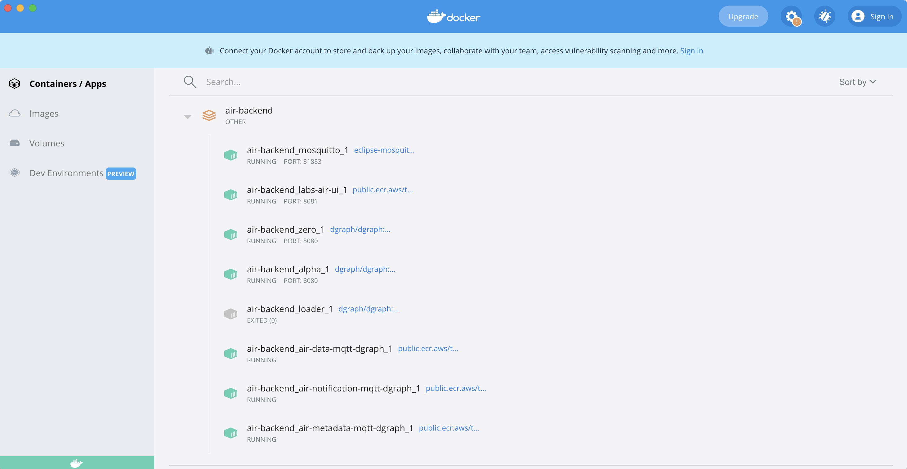
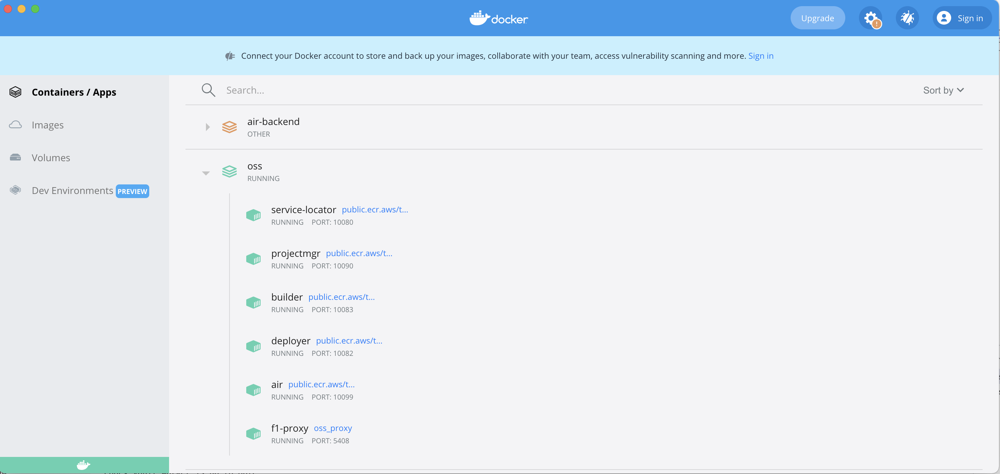
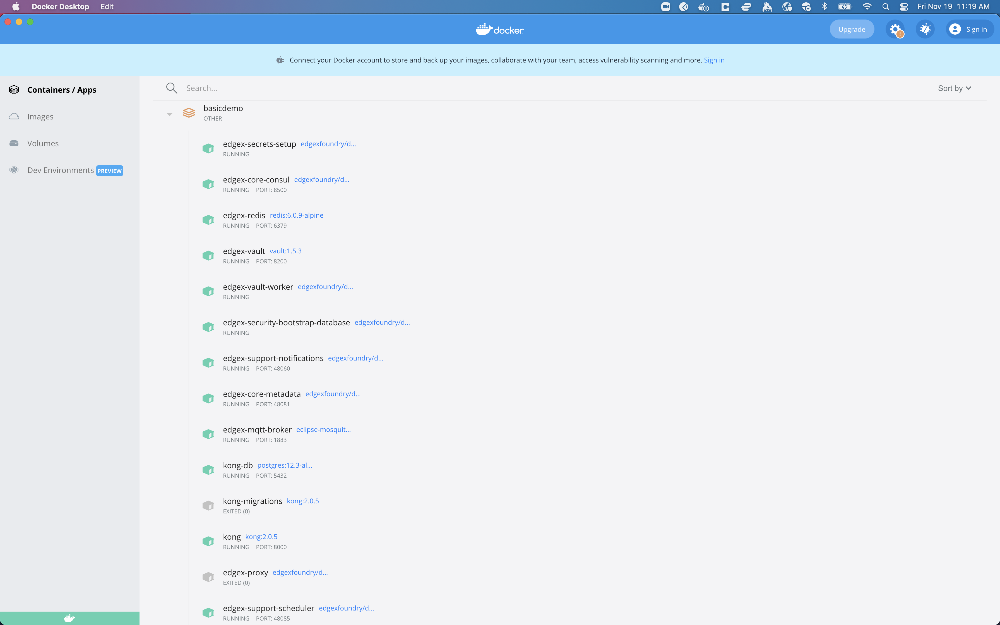

# Prerequisites


  
    MacOs Recommended: Version v11.6 Big Sur
    * Docker Desktop: 20.10.8
  
  
    Linux Recommended: Ubuntu v20.04.3 LTS
    * Docker: 20.10.9
    * Docker Compose: 1.28.2
  
  
    Windows Recommended: Version 10 Pro
    * Docker Desktop: 20.10.8
  


> <b>Got more questions?</b> please check the [Advance Installation Tips](#advanced-installer-tips) section below or reach out on tibcolabs@tibco.com

### helpful URL's
some helpful URL's to find your way quickly

- https://docs.docker.com/get-docker/

> <b>Note:</b> we try to review those in time. <i>Let us know in case a link is broken!</i>

# Install Project AIR Locally

TIBCO LABS Project AIR latest Release Site [here](https://github.com/TIBCOSoftware/labs-air/releases/latest)


  
    1. Download the darwin artifacts from the latest release site
    2. Extract the artifacts and go to the extracted folder
    3. Run the following command:
    
    ./install.sh

  
  
    Download the linux artifacts from the latest release site
    1. Extract the artifacts and go to the extracted folder
    2. Run the following command:
    
    ./install.sh

  
  
    Download the windows artifacts from the latest release site
    2. Extract the artifacts and go to the extracted folder
    3. Run the following command as Administrator:
   
    call install.cmd

  


After all the processes are done you see the following 3 docker compose groups in your docker dashboard

Now you can access project air UI by typing: <a href="http://localhost:8081" target="_blank">http - localhost:8081</a> in your browser locally.

> <b>Got more questions?</b> please check the [Advance Installation Tips](#advanced-installer-tips) section below or reach out on tibcolabs@tibco.com

# Delete Project AIR Locally


  
    1. Download the darwin artifacts from the latest release site
    2. Extract the artifacts and go to the extracted folder
    3. Run the following command:
   
    ./remove.sh

  
  
    Download the linux artifacts from the latest release site
    1. Extract the artifacts and go to the extracted folder
    2. Run the following command:
    
    ./remove.sh

  
  
    Download the windows artifacts from the latest release site
    2. Extract the artifacts and go to the extracted folder
    3. Run the following command as Administrator:
    
    call remove.cmd

  


# Advanced installer tips

  