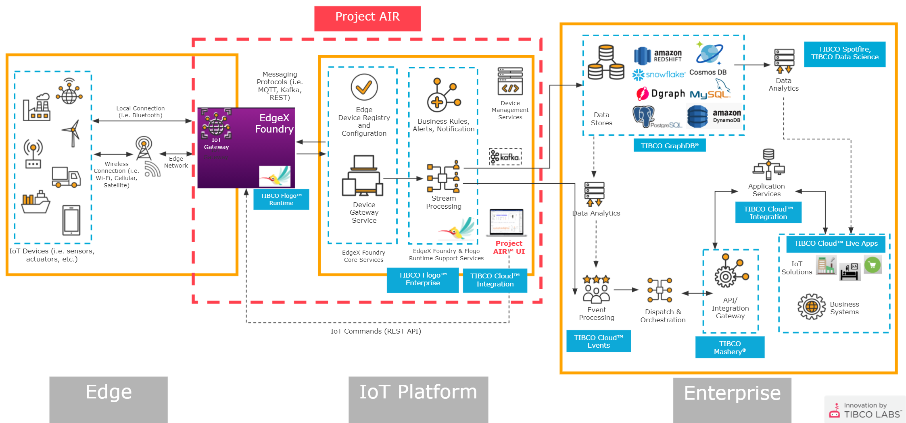

With Project AIR, you can register and interact with IoT Device Farm to process derived data anywhere that is needed and store the data as needed to analyze and address a large number of analytical use cases extending any layer of its architecture as needed.
Connect your IoT Device Farm and take action in TIBCO's connected intelligence cloud.

## Architecture

A sneak peek of AIR’s architecture, more details coming soon.

  

Fully open platform that can run anywhere to support the digitalization of the real world.

- Register and Interact with IoT Devices
- Process IoT Data Regardless of Source
- Compute at the Edge

### Infrastructure
Cloud Agnostic Deployment

- AWS
- Azure *
- GCP *
- On-Prem *

> <b>Note:</b> * = Runs on pre-existing Kubernetes cluster

### Technology Stack
Edge to Cloud Ecosystem

- Edge
- Cloud

### Extension Points
System Pluggability

- Edge
- Data Endpoints
- UI
- Data Stores 

## GitHub Repositories
TIBCO LABS Project AIR consist of multiple Repos <a href="https://github.com/orgs/TIBCOSoftware/repositories?language=&q=air&sort=&type=" target="_blank">full Query here</a>. 
Here a quick Introduction ...

- <a href="https://github.com/TIBCOSoftware/labs-air" target="_blank">labs-air</a> 
  stores the Project Site and Documentation

  - <a href="https://github.com/TIBCOSoftware/labs-air-ui" target="_blank">labs-air-ui</a> 
  AIR user Interface implemented using Angular.io 

  - <a href="https://github.com/TIBCOSoftware/labs-air-edgex" target="_blank">labs-air-edgex</a> 
  configurations of EdgeX Foundry releated to AIR

  - <a href="https://github.com/TIBCOSoftware/labs-air-charts" target="_blank">labs-air-charts</a> 
  bootstraps a Project Air deployment on a Kubernetes cluster using the Helm package manager. 

  - <a href="https://github.com/TIBCOSoftware/labs-air-services" target="_blank">labs-air-services</a> 
  AIR platform backend and edge services based on TIBCO Flogo

  - <a href="https://github.com/TIBCOSoftware/labs-air-contrib" target="_blank">labs-air-contrib</a> 
  AIR platform releated TIBCO Flogo extensions, connectors, and functions

 