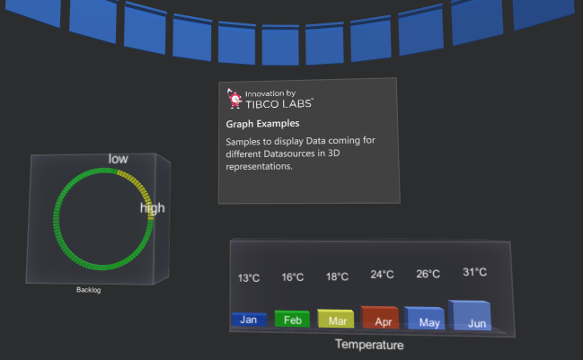
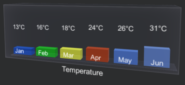
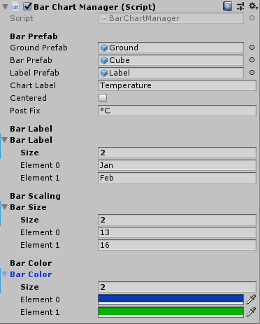
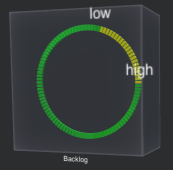
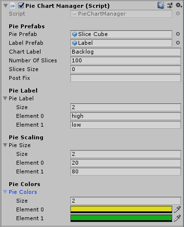

This package helps to render easy 3D Charts within your Unity3D Application. All Charts fully created by using C# Scripting, with this they can fully dynamically be rendered with the provided Data in real-time. 

Open 'TIBCOLabs > Charts > Chart Demo Scene'. The Scene contains all Charts provided here, plus a Scene Description Panel, and some Scene Decoration Assets.

Some Assets using 'TextMesh' others as well 'TextMesh Pro', so 'TextMesh Pro' needs to be loaded into the Project Assets as soon you open the Scene and Unity3D is asking for this additional package.

 Unity3D Charts Demo Scene

All components fully re-sizeable and to work well together with e.g. MRTK in the right size. In case you like to render the charts without the transparent boxes surround, just disable the ‘Mesh Renderer’ inside Unity3D Inspector and the chart will render without the box surround.

### Bar Chart
Generates multiple Bars with the scaled Box surround, it will automatically be extended if there are more than tow Bars and gets smaller in case there is only one Bar to display.

 Bar Chart Sample

 Bar Chart Settings

> This Prefab can be instantiated easily at run-time so that all Settings can be dynamically applied.

### Pie Chart
Generates a Pie Chart out of a number of Prefab Slices, this number is configurable and sizable. 

 Pie Chart Sample

 Pie Chart Settings

> This Prefab can be instantiated easily at run-time so that all Settings can be dynamically applied.

## Import into Unity3D
Just created a new Unity Project and import the custom Package.

## Content
ready to use [Package](https://github.com/TIBCOSoftware/Augmented-Reality/tree/master/packages/TIBCO-Charts) |
Implementation [Source](https://github.com/TIBCOSoftware/Augmented-Reality/tree/master/sources/TIBCO-Charts/Assets)
