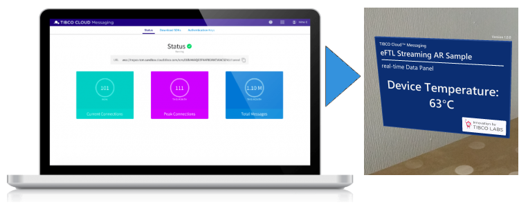
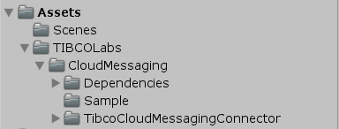
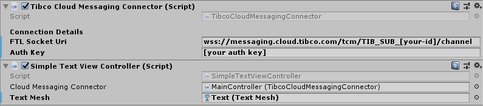
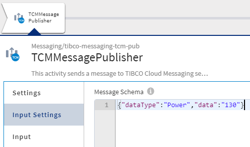

The Implementation is based on standard UnityWebSocket and is working in Unity3D Editor, Android ARCore, and on Microsoft Hololens (UWP).


<br><sup>TIBCO Cloud Messaging Panel</sup>

Once connected, the application can subscribe and receive real-time messages and update the scene accordingly. The Package contains a simple sample Implementation that demonstrates how to display the received data in a Scene TextMesh.

### Trial Account
register for your own TIBCO Cloud™ Messaging trial account on this [Sign-up Form](https://account.cloud.tibco.com/signup/tcm) to get your personal ID and Auth-Key under 'Authentication Keys' Settings Tab, beside the Subscription 'Status'.

### Import into Unity3D
Just created a new Unity Project and import the ready to use Package from the [Packages Folder](https://github.com/TIBCOSoftware/Augmented-Reality/tree/master/packages/TIBCO-Cloud-Messaging/FTL-Basic)


<br><sup>Unity3D Library Assets</sup>

1. drag'n drop the 'MainController' Prefab into your scene
2. drag'n drop the 'Text' Prefab into your scene
3. drag'n drop the 'Text' Object from your scene to the 'MainControler', 'SimpleTextViewController' Component to the 'Text Mesh' Field
4. configure your Web Socket URI and Authkey, in the 'TibcoCloudMessagingConnector' Component

<b>done!</b> Run Unity 'Playmode', and test first using cURL or Flogo - like described below.

### Use the Sample scene
In the min. Implementation for Unity, open: <i>TIBCOLabs > CloudMessaging > Sample > CloudMessaging-TestScene</i>

The ARCore Implementation contains additionally a AR Sample scene: <i>TIBCOLabs > CloudMessaging > CloudMessaging-AR</i>

The Scene contains a MainController Object.
In the MainController, update the Web Socket URI and Authkey of the TIBCOCloudMessaginConnector with you TIBCO Cloud™ Subscription Details.


<br><sup>TIBCO Cloud Messaging FTL Configuration</sup>

## sending Messages
The sample is expecting this type of message:

``` json
{"dataType":"Power","data":"130"}
```

The ARCore Sample supports as well an 'Any' Datatype, more can be implemented in the 'SimpleTextViewController' > 'OnData' Handler.

``` json
{"dataType":"Any","data":"some Text/Alert from the Cloud"}
```

### using cURL
TIBCO Cloud Messaging comes with a REST API, as well. So any REST Tool can be used for testing, too. Just replace [your-id] and [your-key] in the following command:

``` bash
curl -i -u :[your-key] https://messaging.cloud.tibco.com/tcm/TIB_SUB_[your-id]/channel/v1/publish -d '{"dataType":"Power","data":"130"}'
```

### using Flogo
Here a sample using TIBCO Cloud™ Integration Flogo


<br><sup>TIBCO Cloud Integration Configuration</sup>

> the current Implementation subscribes to all instance messaging destinations.

## How it works
1. The MainController GameObject contains the TIBCO Cloud™ Messaging Connector and SimpleTextViewController
2. The SimpleTextViewController extends 'OnData' Handler, it requires a connection (Connector Object) and receives messages.
3. The SimpleTextViewController has a reference to the TextMesh to update when it receives a message.

> the ARCore Sample Project uses 'TextMeshPro' an a pre-defined Panel Object, instead of just 'TextMesh'.

## Target Devices
Tested with Microsoft Hololens, Android Smartphones, inside Unity Editor on Windows 10.

## Used Versions

- Unity (2019.2.18f1)
- Unity AR Foundations (3.1.0)
- Unity AR Subsystem (3.1.0)
- Unity ARCore XR Plugin (3.1.0)
- TIBCO Cloud Nimbus (Release Jan.2020)
- Android 10
- Google Pixel XL
- Microsoft Hololens V1,V2

## Content
ready to use [Package](https://github.com/TIBCOSoftware/Augmented-Reality/tree/master/packages/TIBCO-Cloud-Messaging/FTL-Basic) |
min. Implementation, as Unity Project [Source](https://github.com/TIBCOSoftware/Augmented-Reality/tree/master/sources/TIBCO-Cloud-Messaging/FTL-Basic)<br>
Implementation, for ARCore [Source](https://github.com/TIBCOSoftware/Augmented-Reality/tree/master/sources/TIBCO-Cloud-Messaging/FTL-ARCore)
