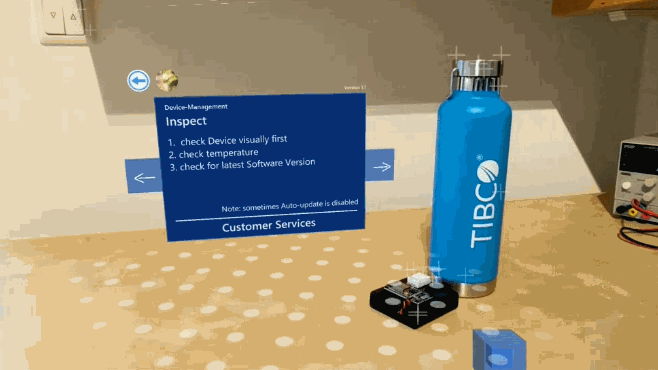
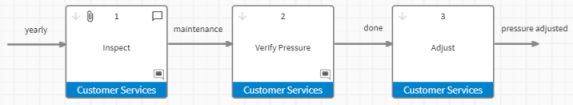
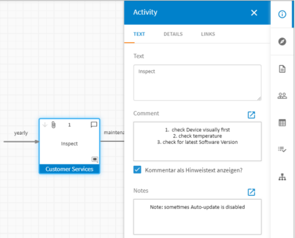
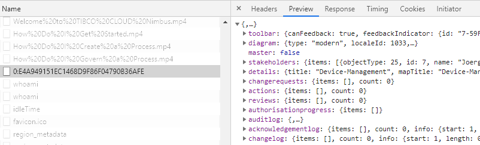

This Sample shows a Nimbus Instruction Guide Activity, defined in the Web-based Maps Designer in the TIBCO Cloud.
The Panel can be placed anywhere on the ground, moved around or fixed in the position. It can be adjusted in scale, rotation, and position-height using an Options Menu that can be opened using a 2-finger touch. 


<br><sup>Unity3D Scene Sample</sup>

Within this Sample, the Navigation between the different Activities is done using the arrow button at the left and right of the shown Activity.

### Trial Account
register for your own TIBCO Cloud™ Nimbus® trial account on this [Sign-up Form](https://www.tibco.com/products/tibco-cloud-nimbus/sign-up) to get your personal Subscription Account.

### Nimbus Maps
the Instruction Guide Activity Map of the in the sample above dynamically rendered in AR.


<br><sup>TIBCO Cloud™ Nimbus® Map</sup>

In Nimbus Maps Designer the first Activity looks like follows


<br><sup>TIBCO Cloud™ Nimbus® Map Activity Details</sup>

Currently, this Sample Implementation supports the following Attributes of this Activity:

- Diagram Title
- Diagram Version
- Diagram Owner
- Activity Title
- Activity Text/Instructions
- Activity Comment/Hint
- Activity Resource/Owner

> Remark: to support Activity Attachments / Links, etc. would be great to add near future.

### Nimbus API
This TIBCO Labs Exploration focused as a first step to support the standard Nimbus JSON that is provided by the private API.
We exploring Ideas of supporting on the fly Map changes as an option, too.

### Nimbus JSON
For Testing open Browser Developer Tools, and go to the Network Tab. Afterward, open your created Nimbus Map 


<br><sup>TIBCO Cloud™ Nimbus® JSON from Chrome Dev Tools</sup>

Search for a Request like the following and copy the JSON response.

```bash
Request URL: https://nimbus.cloud.tibco.com/TIB_SUB_<your Subscription ID>/CtrlWebIsapi.dll/api/process-page/0:<your Nimbus Map ID>
Request Method: GET
```

Store the JSON as 'NimbusMap.json' in your Unity 'Assets/Resources' Folder.

## Target Devices
Tested with AR supporting Android Smartphones and Tablets, [ARCore supported devices](https://developers.google.com/ar/discover/supported-devices).
Glad to hear that it works with ARKit on iOS as well, feel free to raise a GitHub Issue to confirm.

## Used Versions

- Unity (2019.2.18f1)
- Unity AR Foundations (3.1.0)
- Unity AR Subsystem (3.1.0)
- Unity ARCore XR Plugin (3.1.0)
- TIBCO Cloud Nimbus (Release Jan.2020)
- Android 10
- Google Pixel XL

## Content
ready to use [Package](https://github.com/TIBCOSoftware/Augmented-Reality/tree/master/packages/TIBCO-Nimbus/Nimbus-Basic) |
Implementation [Source](https://github.com/TIBCOSoftware/Augmented-Reality/tree/master/sources/TIBCO-Nimbus/Nimbus-Basic/Assets)
