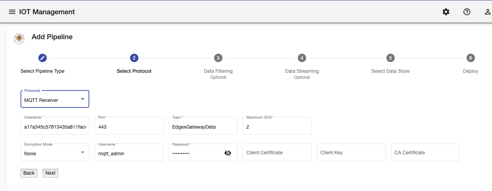
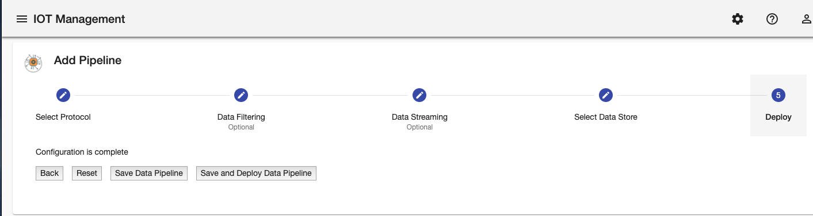
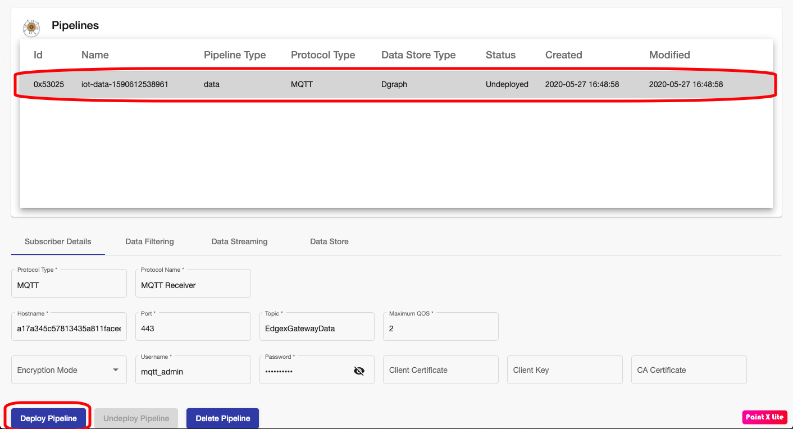
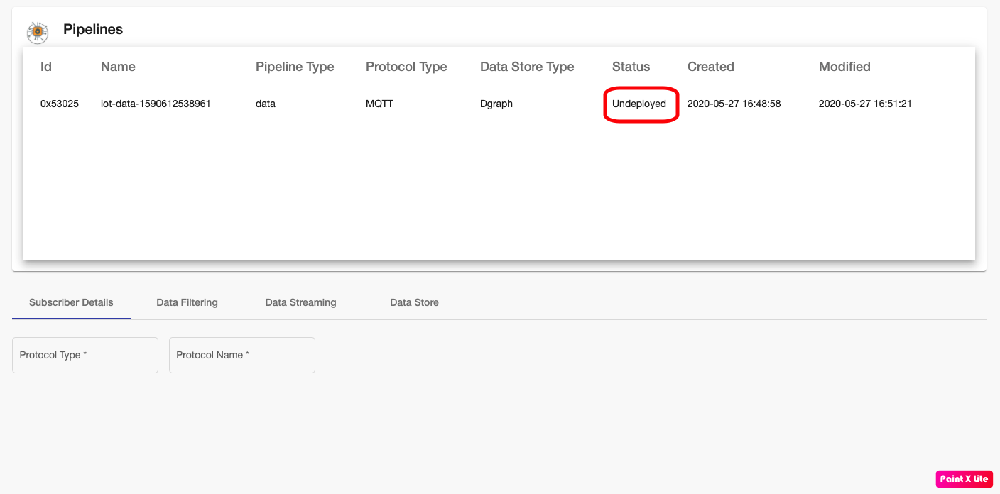

## Introduction
TIBCO Project AIR enables users to configure what to do with data from edge devices.
Users can configure a Data Pipeline to sequence, filter, stream data and specify a data store based on your business logic.
A typical pipeline configuration consists of activities that define the messaging protocol to receive data, define operations on the data (filtering, streaming, rules) and the data stores.
This section will guide you through all the steps required to  create data pipelines.

## Prerequisites

#### Prerequisite 1: Device Groups Configuration

Before you begin, make sure the messaging protocols and data stores configuration for device groups have been configured.  See Configuring Device Groups.

## Adding Data Pipelines

#### Step 1: From the Gateways page, select the Device Group you want to configure and click Data Pipelines.

#### Step 2: The Data Pipelines page should be displayed.

#### Step 3: On the Steps Panel, select the type of Pipeline and then click Next.

You can configure pipelines for device data as well as pipelines for notificatios.

#### Step 4: Select and review the messaging protocol and then click Next

All the messaging protocols that have previously been configured in the Device Groups Configuration will be available for selection

#### Step 5: Select the devices to filter and then click Next.

Data can be filtered from going through the pipeline.

#### Step 6: Configure streaming operations for a device instrument and then click Next

TIBCO Project AIR allows users to perform streaming operations on instrument data. For example you can aggregate the values on a time window and prapagate only the results of the aggregation operation.

#### Step 7: Select and review the data store and then click Next

All the data stores that have previously been configured in the Device Groups Configuration will be available for selection

#### Step 8: Click Save Data Pipeline button.

Save the pipeline configuration.  The configuration can then be deployed to a Kubernetes cluster either local or on the cloud.

## Deploying Data Pipelines

Once data pipelines have been configured, they can be deployed dynamically to Kubernetes cluster running locally or on the cloud.

#### Step 1: Select the desired pipeline from the Pipelines table and then click  Deploy Pipeline

#### Step 2: The pipeline is deployed and should show the Status as Deployed/Ready

## Updeploying Data Pipelines
If data from a device is not longer required or if needs to be modified, you can undeploy the pipeline.  Undeploying will remove the engine processing the data from the Kubernetes cluster.

#### Step 1: Select the desired pipeline from the Pipelines table and then click  Undeploy Pipeline

#### Step 2: The pipeline is undeployed and should show the Status as Undeployed

## Deleting Data Pipelines
If data pipelines are not longer required, you can delete the pipeline. Notice that deployed pipelines can't be deleted.  They need to be undeployed first.

#### Step 1: Select the desired pipeline from the Pipelines table and then click  Delete Pipeline

#### Step 2: The pipeline is deleted and should not appear in the Pipelines table.