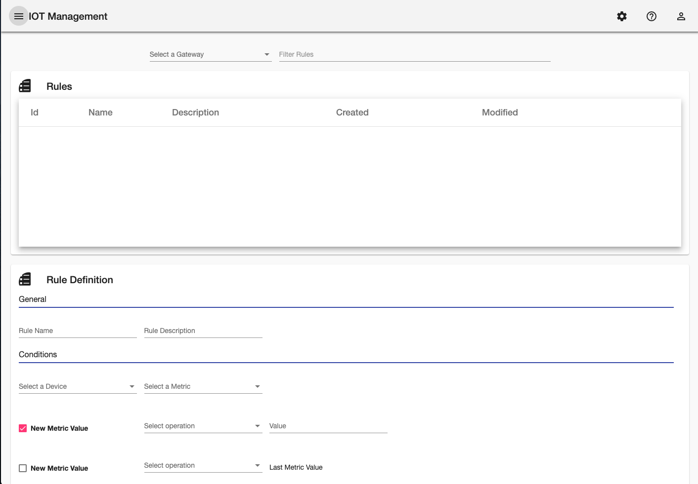
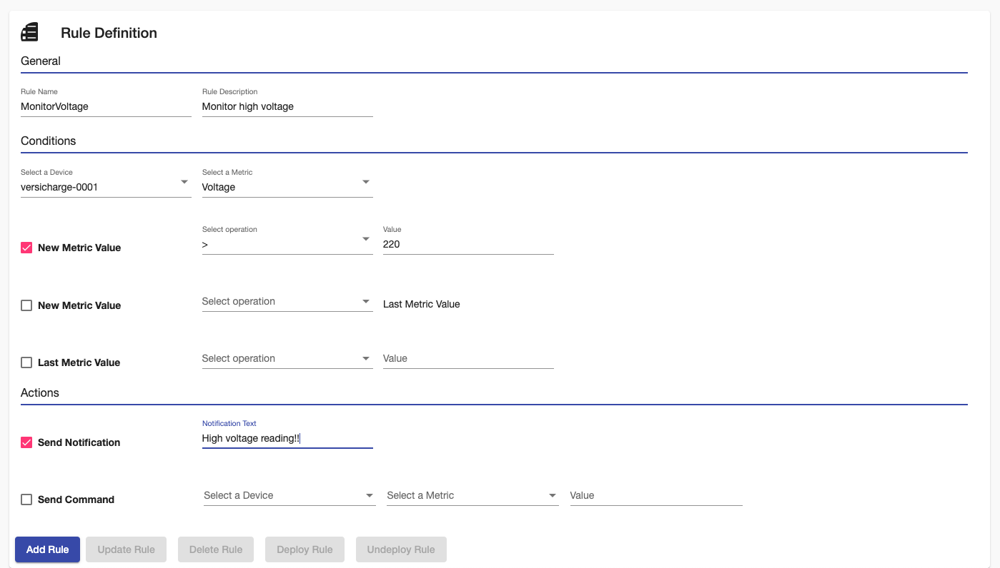
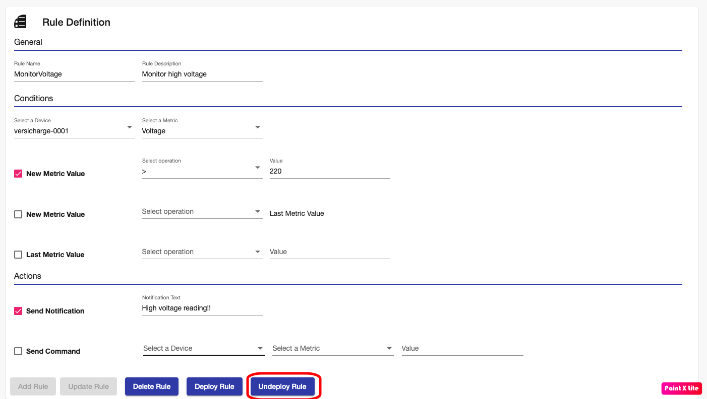

## Introduction
TIBCO Project AIR enables users to work with data at the edge. The user can configure rules that can be applied to device data before it is sent to the cloud.  It also provides capabilities to configure rules to trigger actions on other devices if a condition is met.
A typical rule configuration consists of conditions on the values of a device, and actions to be taken when the conditions are met.
This section will guide you through all the steps required to  create edge rules.

## Prerequisites

#### Prerequisite 1: Device Groups Configuration

Before you begin, make sure the messaging protocols and data stores configuration for device groups have been configured.  This is required if the rule will be configured to send notifications to the cloud. See Configuring Device Groups.

 ## Adding Edge Rules

#### Step 1: From the Main Menu, select Edge Rules.

#### Step 2: Select the Device Group for which the rule is going to be configured for.

#### Step 3: On the Rule Definition panel, configure the rule by enter the following information and then click Add Rule

* Rule Name
* Rule Description
* Enter conditions
    * Select Device
    * Select a metric (instrument) on the device
    * Select the conditions to apply and configure the operation and values to compare to.
* Enter actions
    * Select the actions to apply and configure the notification or action to be sent to another device.

The configuration can then be deployed dynamically to the edge.

#### Step 4: Rule is saved for later use and deployment.

## Deploying Rules

Once the rules have been configured, they can be deployed dynamically to a rules engine running at the edge.

#### Step 1: Select the desired rule from the Rules table

#### Step 2: Review rule and click the Deploy Rule button.

## Viewing Notifications

Rules can be configured to send notifications to cloud applications and data stores. The followin steps show how to view notifications.

#### Step 1: From the Main Menu, select Notifications.

#### Step 2: Review all notifications

## Updating Rules
If a rule needs to be modified, make sure the rule is first  undeployed and then update conditions and actions.

#### Step 1: Select the desired rule from the Rules table and then click  Update Rule

#### Step 2: The rule is updated

## Updeploying Rules
If a rule is not longer required or if needs to be modified, you can undeploy the rule.  Undeploying will remove the rule from the rule engine running on the edge.

#### Step 1: Select the desired rule from the Rules table and then click  Undeploy Rule

#### Step 2: The rule is undeployed

## Deleting Rules
If rules are not longer required, you can delete the rule. Notice that deployed rules can't be deleted.  They need to be undeployed first.

#### Step 1: Select the desired rule from the Rules table and then click  Delete Rule

#### Step 2: The rule is deleted and should not appear in the Rules table.