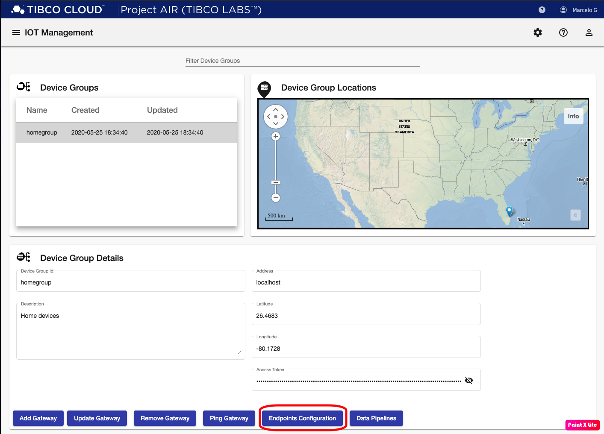
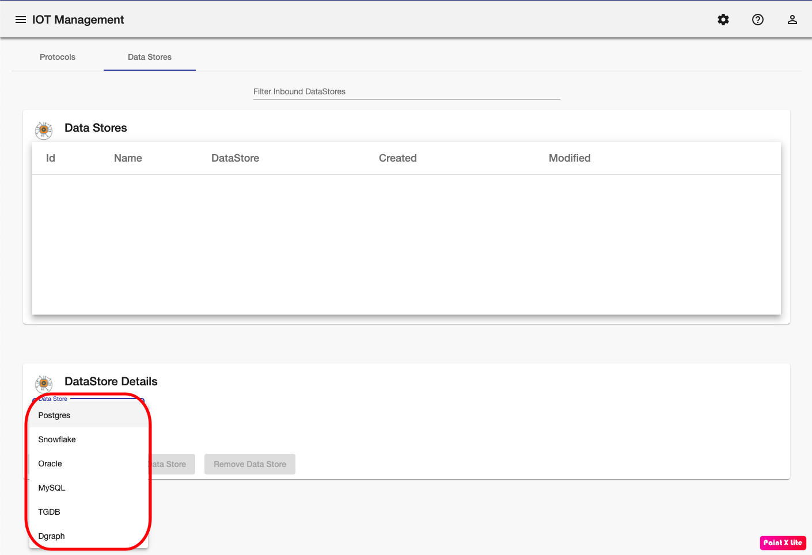

## Introduction
Once a Device Grouping has been created, a connection has been established with Edgex devices and now we wil show you how to configure Messaging Protocos and Data Stores that will be used to receive and store data from devices.
The following steps will guide you through the configuration of messaging protocols and data stores.

## Prerequisites

#### Prerequisite 1: Edgex

Edgex is a vendor neutral open source platform at the edge of the network that interacts with physical devices, sensors, actuators and other IoT objects. It enables the interoperability between devices and applications at the edge and at the cloud.

* [Edgex](edgexfoundry.org)

Every running Edgex platform will provide one or more Service to export data from the edge. From a running instance of Edgex, gather the following information from each of the available Export Services:

 * Transport used: MQTT, Kafka or TCM
 * Connection URL
 * Connection credentials

#### Prerequisite 2: Data Store Information

Device data can be stored in one or several data stores depending on the use case requirements. Gather the following information for each data store:

* Connection URL
* Connection Credentials

#### Prerequisite 3: Data Store Table Setup

For each data store, tables to store the data need to be created. Project AIR scripts with SQL commands to create the required artifacts.

 ## Accessing Endpoints Configuration

#### Step 1: From the Gateways page, select the Device Group you want to configure.

#### Step 2: Click the Endpoints Configuration button.

#### Step 3: The Endpoint configuration page should be displayed.

## Adding Messaging Protocols

#### Step 1: Select the desired protocol from the pulldown menu under the Protocol Details panel

#### Step 2: Enter required information for the selected protocol

#### Step 2: Click the Add Protocol button. The new protocol configuration should be shown in the Inbound Protocols panel

## Adding Data Stores

#### Step 1: Click the Data Stores tab

#### Step 2: Select the desired data store from the pulldown menu under the DataStore Details panel

#### Step 3: Enter required information for the selected data store

#### Step 4: Click the Add Data Store button. The new data store configuration should be shown in the Data Stores panel

