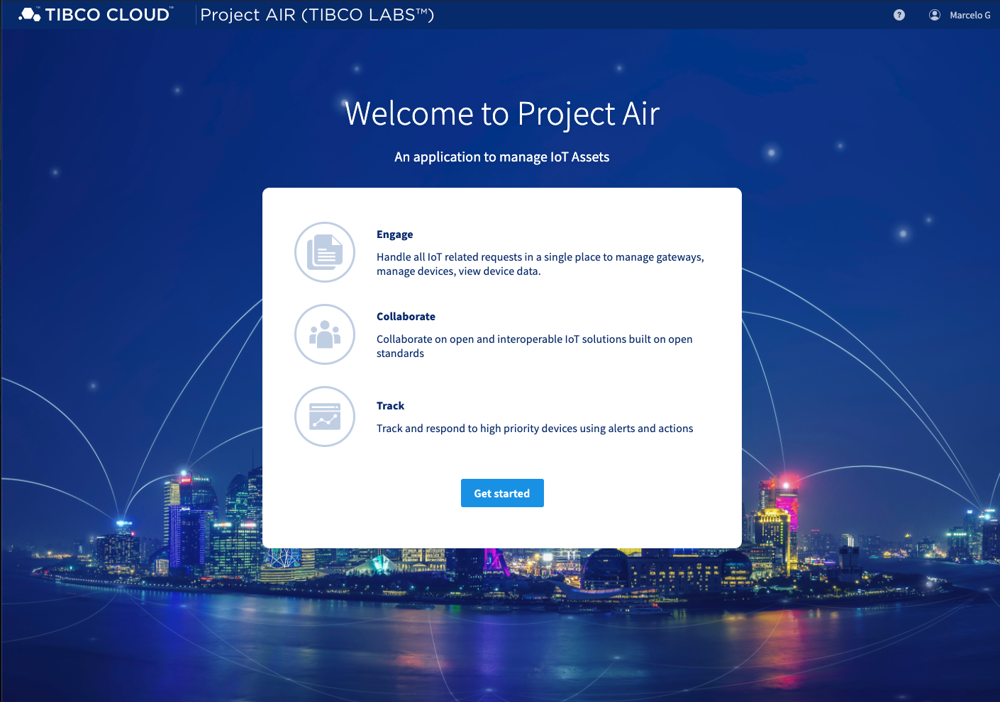
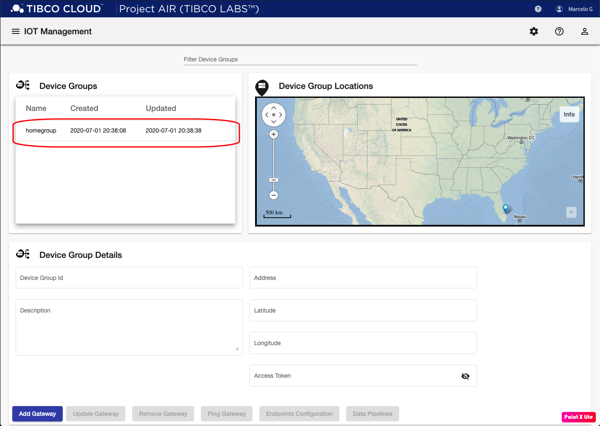
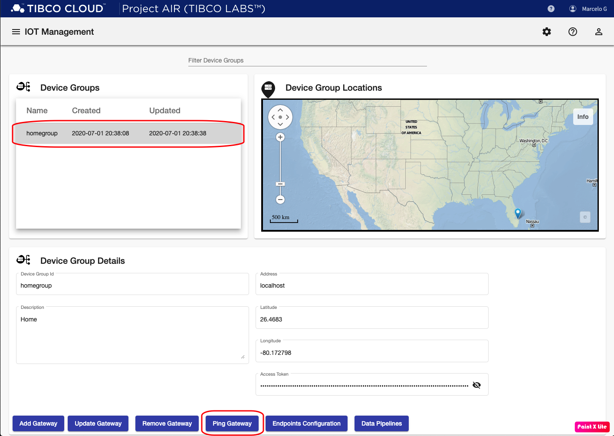

## Introduction
The following steps will guide you to login and get started with TIBCO Project AIR™ UI.

## Prerequisites

#### Prerequisite 1: TIBCO Cloud™ Account
Sign up for a TIBCO Cloud™ Account

* [TIBCO Cloud™ Account](https://account.cloud.tibco.com/)

#### Prerequisite 2: Activate TIBCO Cloud™ Account
Check your email and activate your account

#### Prerequisite 3: Make sure TIBCO Project AIR™ UI is running

## Login Steps

#### Step 1: Open TIBCO Project AIR™ UI web page

Open TIBCO Project AIR™ UI by clicking the link below:

* [TIBCO Project AIR™ UI](https://localhost:4200/)

#### Step 2: Enter your TIBCO Cloud™ Account credentials

#### Step 3: Once you are in, click the Get started button.

#### Step 4: You are ready to manage your devices.

All edge gateways connected to the AIR infrastructure should be displayed automatically.  Note that gateways are auto registered by default.  

If no gateways are running or are not enabled for auto registration, then an empty list of device groups should be displayed. 

#### Step 3: Verify connection to Edgex Gateways
You can verify the connection to the edge gateways by clicking an entry under Device Groups table on the top-left corner panel and then click Ping Gateway.
If the connection is succesful, you should see a Success banner. Otherwise, a Failure banner is displayed and you should review that Edgex is running or make sure the Address and Access Token parameters are correct.

