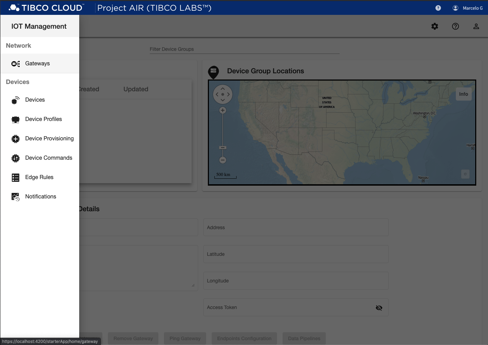
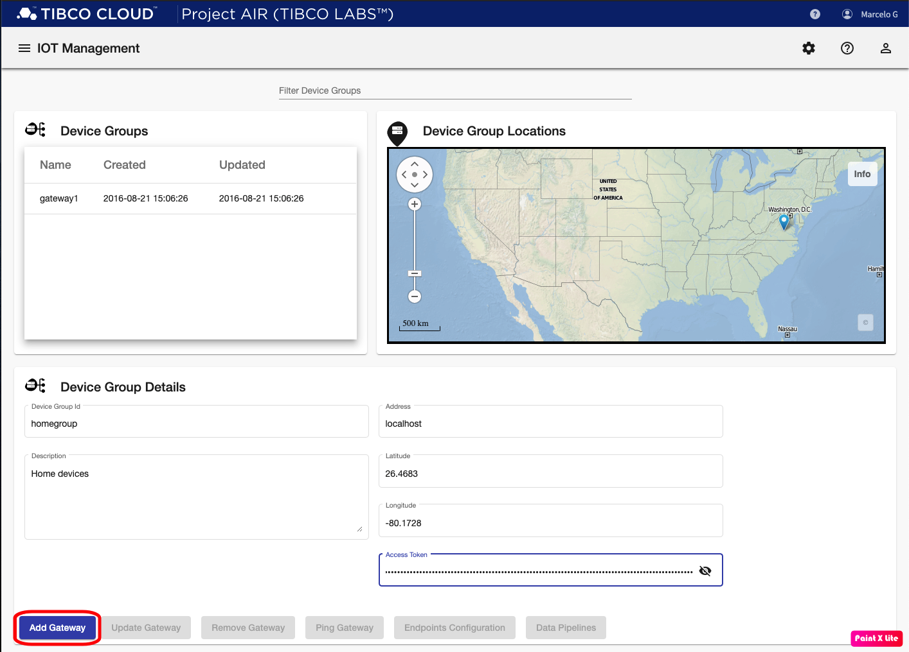
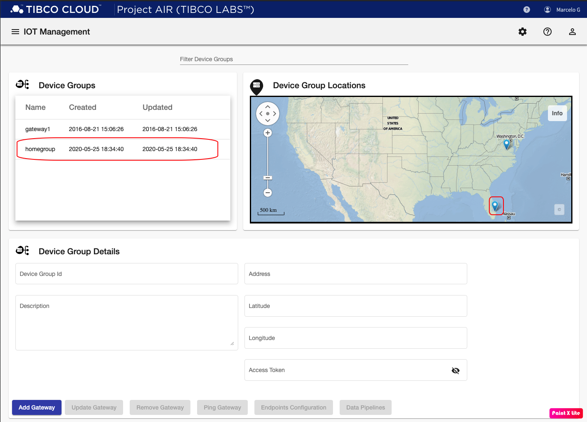
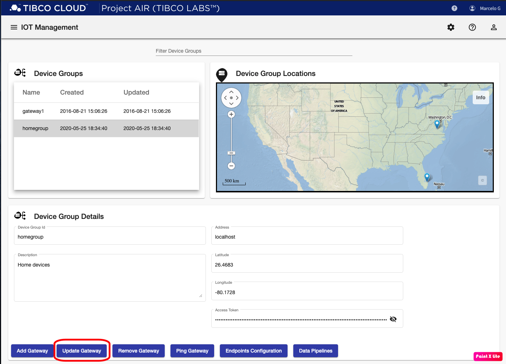

## Introduction
The following steps will guide you through the creation  and management of device groups.
A device group represent a number of edge devices controlled and managed by the Edgex platform.

## Prerequisites

#### Prerequisite 1: Edgex

Edgex is a vendor neutral open source platform at the edge of the network that interacts with physical devices, sensors, actuators and other IoT objects. It enables the interoperability between devices and applications at the edge and at the cloud.

* [Edgex](edgexfoundry.org)

From a running instance of Edgex, gather the following information:

 * Edgex Instance Name
 * Overall gps coordinates of where the Edgex platform is running
 * Edgex gateway api security token

 #### Prerequisite 2: Project AIR UI

Login to TIBCO Project AIR™ UI

 ## Adding Device Groups Steps

#### Step 1: Click the IoT Management menu on the top left corner and select Gateways.

#### Step 2: On the Gateways page, enter the following information and then click Add Gateway:

* Device Group Id: the grouping name from Edgex
* Description: a description for the group of devices
* Address: the ip address of the machine where Edgex Gateway is running.
* Latitude: Edgex machine latitude
* Longitude: Edgex machine longitude
* Access Token: The Edgex security token

#### Step 3: Verify connection to Edgex
 Once the grouping has been added, click the grouping on the Device Groups table on the top-left corner, and then click Ping Gateway.  If the connection is succesful, you should see a Success banner. Otherwise, a Failure banner is displayed and you should review that Edgex is running or make sure the Address and Access Token parameters are correct.

## Updating Device Group Steps

#### Step 1: Select grouping to be updated from the Device Groups table.

#### Step 2: Modify groupin parameters as required. Note that the Device Group Id can not be modified.

#### Step 3: Click the Update Gateway button.

## Removing Device Group Steps

#### Step 1: Select grouping to be removed from the Device Groups table.

#### Step 3: Click the Delete Gateway button.

#### Step 3: Verify removed gateway is not longer in the Device Groups table.

