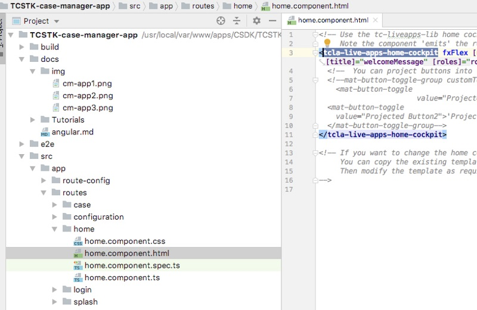
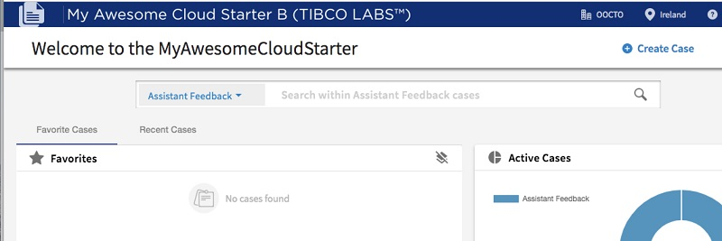

## Basic Developer Use Cases


### Change Home Page layout

Developer wishes to change the look and feel of the home page component
>Note initial release will include component schematics for home page, case page, config page, login page, splash page → more sub-components to follow)

#### 1.) Developer creates new home page component from schematic in editing tool or cmd line:

To create a new component based on the original Home Page Component :
- right click on the component folder
- select "New"/"Angular Schematics..."
- choose the schematics "New Custom Home Cockpit"


#### 2.) Then you will get the new generated component


#### 3.) You will be then able to use this component instead of the original one by replacing the one used in the file 




#### 4.) Finally, you can simply edit the new component template HTML file to change the layout to whatever you like

<br>
<br>


### Change Logo

If you want to change the logo on top left, you can do so by :

#### 1.) Edit the file containing the NavBar component

File is in .src/app/routes/starter-app/starter-app-component.html


#### 2.) Add the following parameter to the "tc-cloud-nav-bar" : logoUrl

You can get the list of parameter with autocompletion in well configured angular editor (here what you could see in webstorm)


#### 3.) Set the new image to be linked to a variable called logoUrl

```
 [logoUrl]="logoUrl"
```


#### 4.) Create the logoUrl var in the controller of the component

Edit the file .src/app/routes/starter-app/starter-app-component.ts

with that content

```javascript
import {Component, OnInit, ViewEncapsulation} from '@angular/core';
import {ActivatedRoute, Router} from '@angular/router';
import {LiveAppsService} from '@tibco-tcstk/tc-liveapps-lib';
import {GeneralConfig, TcCoreCommonFunctions} from '@tibco-tcstk/tc-core-lib';
import {Title} from '@angular/platform-browser';
import {Location} from '@angular/common';

@Component({
  selector: 'app-starter-app',
  templateUrl: './starter-app.component.html',
  styleUrls: ['./starter-app.component.css'],
  encapsulation: ViewEncapsulation.None
})
export class StarterAppComponent implements OnInit {

  public config: GeneralConfig;

  public logoUrl = TcCoreCommonFunctions.prepareUrlForStaticResource(this.location, 'assets/images/mylogo.svg');

  constructor(private route: ActivatedRoute, private router: Router, private titleService: Title,  private location: Location) { }

  ngOnInit() {
    // each route uses a resolver to get required data for any components it uses
    // For example here the general config is read from this.route.snapshot.data.config
    // That config is available because the starterApp route ran the GeneralConfigResolver when defined in case-route-config.ts
    // *****
    // case-route-config.ts:
    // path: 'starterApp',
    //         component: StarterAppComponent,
    //         canActivate: [AuthGuard],
    //         resolve: {
    //           claims: ClaimsResolver,
    //       --> config: GeneralConfigResolver  <--    *config* is this.route.snapshot.data.config below
    //         },
    //         children: STARTER_APP_ROUTES

    this.config = this.route.snapshot.data.config;
    this.titleService.setTitle(this.config.browserTitle ? this.config.browserTitle : 'Tibco Cloud Starters');
  }

}
```

Basically, 

Line 18, you need to create the variable logoUrl and assign it to an image

Line 20, add location to you constructor

Line 4, add the proper import to set the image path to the right location (that can differ where ever you test or deploy the app)

Line 6, add the proper import to get Location


#### 5.) Copy an mylogo.svg to the folder /src/assets/images/

>Note : 
>- you might have to create the folder "images"
>- you can find in here a mylogo.svg


#### 6.) View the result



