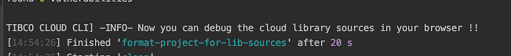

## Advanced Developer Use Cases
Note: Before you continue understand that these procedures adjust your package.json, angular.json and your tsconfig.json files. Backups are made, but make sure that you have an understanding of the content of these files and the impact on your application.

### TIBCO Cloud CLI

Before you use the Cloud CLI you must set the connection to the TIBCO Cloud, you can do this in the tibco-cloud.properties file. In here fill in the following details:

```
CloudLogin.tenantID=bpm
CloudLogin.clientID=<Client ID>
CloudLogin.email=<Your Email>
CloudLogin.pass=<Your (obfuscated password) Password>
```
You can get the Client ID with the procedure described in the getting started guid.
You can obfuscate a password by typing:

```
Gulp obfuscate
```
Note: An obfuscated password can still be retrieved, be carefull sharing this or checking this into source control.


You can start the Cloud CLI by typing

```Gulp```

This brings you in the following menu:


From here you can do a number of tasks:

 * Debug Application
 * Build Application
 * Deploy Application
 * Publish Application
 * Test Cloud Login
 * List Cloud Applications
 * Show Cloud Links
 * Obfuscate a password
 
## Debug Application

To debug the TIBCO Cloud Libraries used in your application like:
 * tc-core-lib
 * tc-forms-lib
 * tc-liveapps-lib
 
Make sure your application is stopped and your `package.json`, `angular.json` and `tsconfig.json` files are in synch with their `.build` versions.  Also ensure you that you have back-upped any resources in the `projects` and `tmp` folders. 

Now run the `inject-lib-sources` command from the cloud cli.  



No you can start your application and in your browsers development console you see the Typescript sources of the original typescript files from the libraries for debugging purposes:


Note: Code changes to the libraries won't affect the actual library NPM packages.

In order to revert the debugging setup, run `undo-lib-sources` in the cloud CLI.
