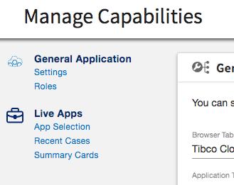

###### Configuration file name

configurationMenuConfig.json

###### Configuration file description

This file is used to setup the configuration sections we will show when entering the configuration route.



###### Example
```javascript
{  
  "menu": [     //  <== List of the section to display
    {  
      "entry": "General Application", // <== Name of the section
      "icon": "tcs-starters-icon",    // <== Icon for the section
      "options": [                    // <== List of subsection 
        "Settings",  
        "Roles"  
  ]  
    },  
    {  
      "entry": "Live Apps",  
      "icon": "tcs-liveapps-sm-icon",  
      "options": [  
        "App Selection",  
        "Recent Cases",  
        "Summary Cards"  
  ]  
    }  
  ]  
}
```

**Notes**

Associated routes should exists with the following convention:

```
[entry]-[options]
```

> where both are transform to lower case with "-" replacing " "

_Example_: for the first subsection, the route should be name like

```
general-application-settings
```


