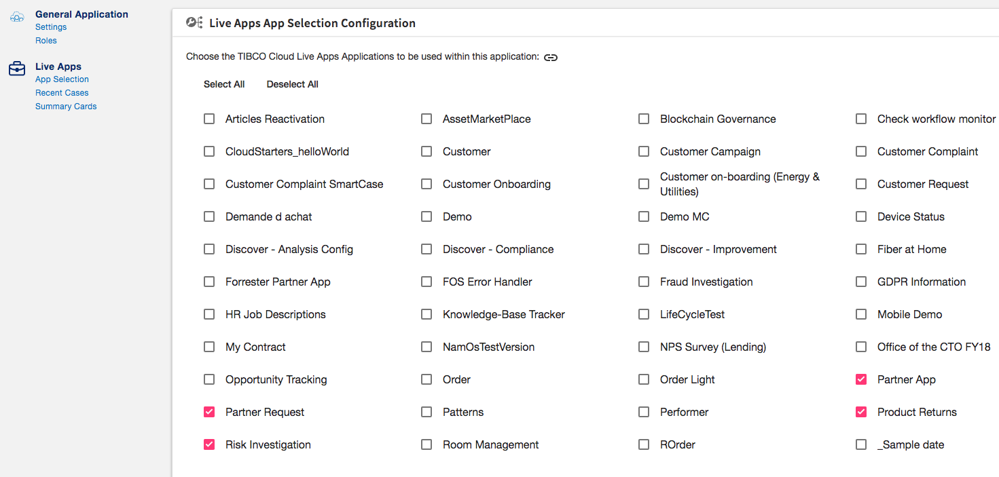

###### Configuration file name

liveAppsConfig.json

###### Configuration file description

This file is here to initialize, on first browse, the LiveApps application you want to use.

This setting could then be changed in the configuration section for LiveApps.



###### Example
```javascript
{
  "applicationIds": [1233, 234]  //  <== List of the LA application ID you want to use
}
```

**Notes** 

If the array is empty, the app will use ALL LiveApps applications in your subscription


