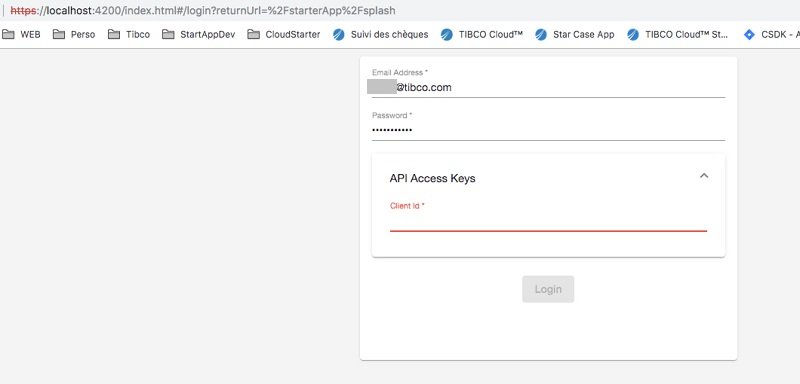

## How to obtain API Key Client ID

Video Link of this Tutorial

<iframe width="250" height="150" src="https://www.youtube.com/embed/MuzQDo1RPxU" frameborder="0" allow="accelerometer; autoplay; encrypted-media; gyroscope; picture-in-picture" allowfullscreen></iframe>

## the Steps in Detail

When you will browse the ProjectAir Application you will get ask your subscription Login (your email) and your password but also a ClientID (used as an double security key)

To get this ClientID :
 - Browse and log in Tibco Cloud with either :
 
      [EU subscription](https://eu.account.cloud.tibco.com/manage/home)
      
      [US subscription](https://account.cloud.tibco.com/manage/home)
      
      [AU subscription](https://au.account.cloud.tibco.com/manage/home)
 
 
 - Click on your name at the top right 
 
 
 
 
 - Click on "Settings"
 
 
 
 
 - Click on "Advanced Settings"
 
 
 
 
 - Click on "Display Client ID", then on  "Copy"
 
 
 

#### Log into the App

Then you just have to log in with your credentials and the ClientId

 
 
 And you will get in the app
 
 

