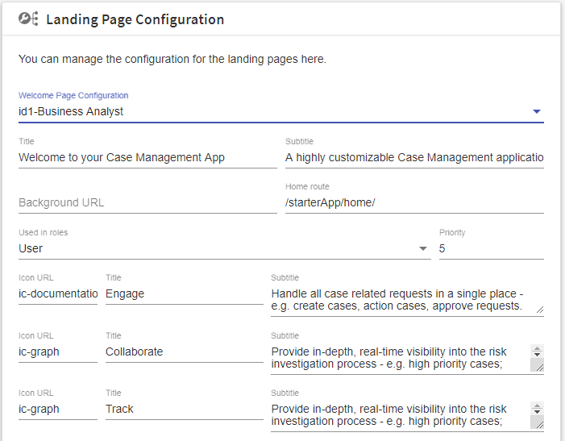

## Configure

The ProjectAir App comes with easy adjustable Configuration Settings, most of them can be adjusted at anytime within the Application itself in case the User has the "App Configuration Role". In this Case the Settings is saved to the App specific Shared State.

> In case the Application is installed the first time (on first browse of the app), the Settings are taken from JSON Configuration Files delivered with the App. These JSON Files contain some more detailed Settings as what is available via the UI.

To browse the screens in the below section, just click on the setting icon on top right of the app


### General Application Settings

Allows to adjust e.g. application title, welcome message, help content


### Application Roles

Allows to change application roles for normal users, administrators and configurators.


### Landing Page

You can adjust everything you can find on the App Landing Page, make the App more use case specific and re-branded. Even changing the Background Image is quickly possible.



### App Selection

Only the selected TIBCO Cloud™ Live Apps of your Subscription are available within the App. This allows you to deploy multiple 'ProjectAir Apps' with different 'uiAppId' (config JSON) and see only some relevant Case Types within one App.


### Recent Cases

Here you can configure what kind of Cases you like to see in the Overview 'Recent Cases' Component.
Be careful, you need to select the Apps you want to exclude.


### Summary Cards

The Look and Feel of all Case Summary Cards can be adjusted as well, including colors and SVG State Icons displayed. e.g. you can quickly make exception case state red.


## Configuration Files

All pre-defined Configurations can be found in the folder.

```
src/assets/config
```

Details about the Files can be found it App Config Section of this Documentation Site.

> Note: adjustments in the JSON Files not updating the Shared State after the App is started once, as the Shared State exists already. You can use the Shared Client State Service API to delete an already initializes App Shared State again.

## Shared State

TIBCO Cloud™ Live Apps Shared Client State Service provides a mechanism for storing and publishing UI state information. For these client-specific customization parameters we use just the PUBLIC State - This type of State can be read by all users in the subscription, but can be updated or deleted only by users with App OWNER or AUTHOR roles.

You can access the Shared State Help page :

[Help for EU subscription](https://eu.liveapps.cloud.tibco.com/apps/api-explorer/index.html#/swaggerUi?feature=..~2Fyaml~2Fss-service.v1.yaml)

[Help for US subscription](https://liveapps.cloud.tibco.com/apps/api-explorer/index.html#/swaggerUi?feature=..~2Fyaml~2Fss-service.v1.yaml)

[Help for AU subscription](https://au.liveapps.cloud.tibco.com/apps/api-explorer/index.html#/swaggerUi?feature=..~2Fyaml~2Fss-service.v1.yaml)
