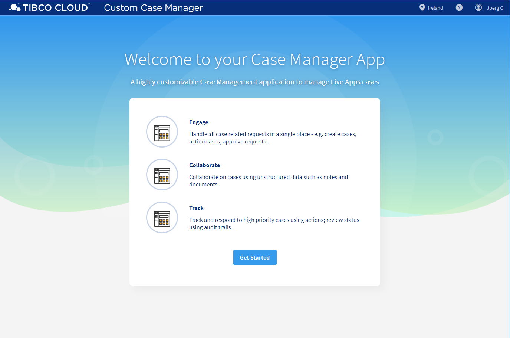
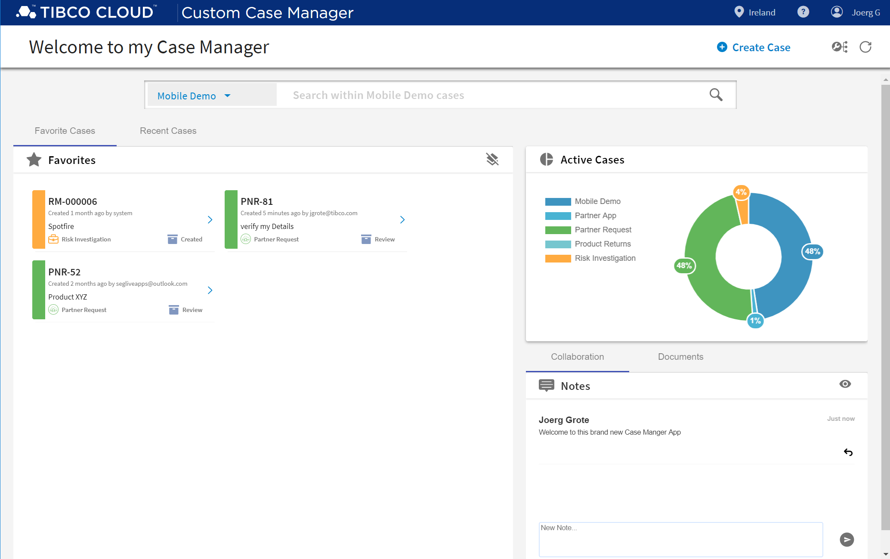

### TIBCO Cloud™ Starters Toolkit - ProjectAir App
The Pattern - ProjectAir App, containing all core and essential Case Management Features to create more advanced low-code applications based on TIBCO Cloud™ LiveApps.

**Splash Screen**

Welcome and Application Overview, fully use case specific adjustable.

**Cases Overview**

Case Search, Case Statistics, Favorite and Recent Cases Lists, plus Application Collaboration Notes.

**Case Instance Details**

Milestone Tracker, Case Actions, User Forms, Case Instance Collaboration Notes, Case Document Attachments, State and Audit Trail.

[Link to Application GIT](https://github.com/TIBCOSoftware/TCSTK-case-manager-app/)  build out of Components from [Link to Component GIT](https://tibcosoftware.github.io/TCSToolkit/Angular/components/liveapps/live-apps-actions/Actions/)

All used Background Details and Getting Started HowTos [here.](https://tibcosoftware.github.io/TCSToolkit/Angular/docs/1.%20Prerequisites/)

### Videos 
a quick first video, to get an impression.

<iframe width="560" height="315" src="https://www.youtube.com/embed/x9qW8HhH-mM" frameborder="0" allow="accelerometer; autoplay; encrypted-media; gyroscope; picture-in-picture" allowfullscreen></iframe>

Link: [YouTube](https://youtu.be/x9qW8HhH-mM) ~2 min

### Help / How to 
#### Get Started 
some quicks way to get started

- [Getting Started](docs/tutorials/001-Get-your-ClientID.md)
- [Configure](docs/tutorials/002-Configure.md)

#### Configure 
how to configure the App

- [UI App ID](src/assets/config/uiAppId.md)
- [general App Configuration](src/assets/config/generalAppConfig.md) 
- [configuration Menu Configuration](src/assets/config/configurationMenuConfig.md)
- [route Access Control](src/assets/config/routeAccessControl.md)
- [Custom Forms](src/assets/config/customForms.md) 

> All Configuration JSON Files can be found in "src/assets/config".

#### Basic Developer
dome basic Developer focused Details 

- [Basic Developer Use Cases](docs/tutorials/003-Basic-Developer.md)

#### Deploy 
how to deploy the App

- [Deploy Usecase](docs/tutorials/004-Deployment.md)

#### Advanced Developer
more advanced Details

- [Advanced Developer Use Cases](docs/tutorials/005-Advanced-Developer.md)

## License
Copyright © 2020. TIBCO Software Inc. 
This file is subject to the license terms contained in the license file that is distributed with this file.

Please see 'tpc.txt' for details of license and dependent third party components referenced by this library.
